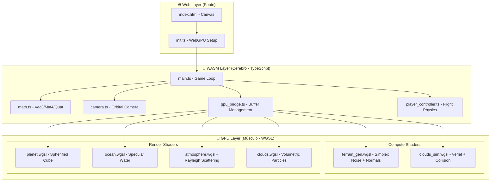

# 🌍 Mini-Engine WebGPU — Plano de Implementação

## Arquitetura Geral

## Módulos por Prioridade

| # | Módulo | Arquivo | Tipo | Status |
|---|--------|---------|------|--------|
| 1 | Math Library | `wasm/math.ts` | CPU | ✅ |
| 2 | GPU Bridge | `wasm/gpu_bridge.ts` | CPU | ✅ |
| 3 | Simplex Noise + Terrain Gen | `shaders/compute/terrain_gen.wgsl` | GPU | ✅ |
| 4 | Planet Renderer | `shaders/render/planet.wgsl` | GPU | ✅ |
| 5 | Ocean Renderer | `shaders/render/ocean.wgsl` | GPU | ✅ |
| 6 | Atmosphere | `shaders/render/atmosphere.wgsl` | GPU | ✅ |
| 7 | Cloud Simulation | `shaders/compute/clouds_sim.wgsl` | GPU | ✅ |
| 8 | Cloud Renderer | `shaders/render/clouds.wgsl` | GPU | ✅ |
| 9 | Camera Controller | `wasm/camera.ts` | CPU | ✅ |
| 10 | Player Controller | `wasm/player_controller.ts` | CPU | ✅ |
| 11 | Main Loop | `wasm/main.ts` | CPU | ✅ |
| 12 | Web Init | `web/init.ts` | Ponte | ✅ |
| 13 | HTML Canvas | `web/index.html` | Ponte | ✅ |

## Validação

- `npx -y -p typescript@5.9.3 tsc --noEmit --target es2022 --module esnext --lib dom,es2022 --moduleResolution bundler ...` executado com sucesso
- Arquivo auxiliar `engine/webgpu.d.ts` adicionado para suprir tipagem WebGPU mínima no ambiente local

## Decisões de Design

> [!IMPORTANT]
> - **Memória Linear**: Todos os arrays de dados (posições, normais, alturas) usam `Float32Array` contíguos para compatibilidade WASM
> - **Zero Allocation Loop**: O game loop não faz alocação — buffers pré-alocados
> - **GPU-First**: Geometria e simulação 100% na GPU via Compute Shaders
> - **Spherified Cube**: 6 faces de um cubo projetadas numa esfera — melhor distribuição de vértices que UV sphere
